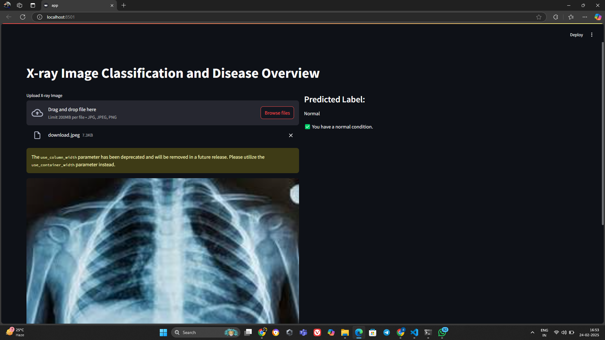
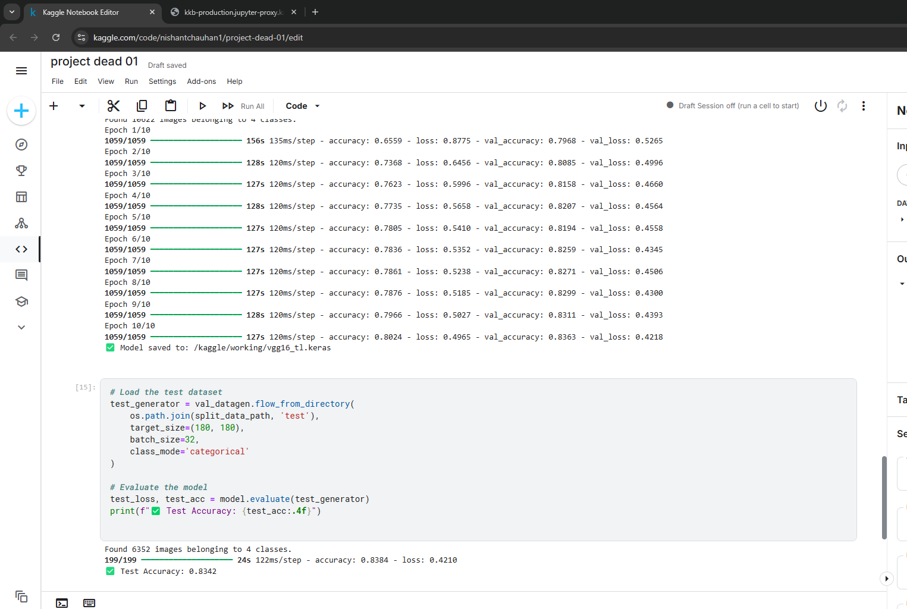

<h1>X-Ray Image CLassigication using CNN and LLM (Large Language Model)</h1>

# X-ray Image Classification using CNN and LLM

### Model Output Examples:

**Output 1:**  


**Output 2:**  



Follow the steps to setup and run the project on your local computer.

- Create Environment
```
virtualenv .venv
```

- Active environment

on Linux
```
source .venv/Scripts/activate
```

- Install packages
```
pip install -r requirements.txt
```

- Start the app
```
streamlit run main/app.py
```

- Open the URL to view the app
```
http://localhost:8501/
```